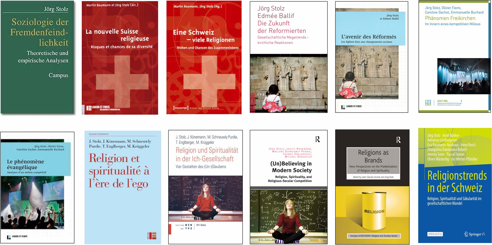

### Books

2022	Stolz Jörg, Bünker Arndt, Liedhegener Antonius et al. Religionstrends in der Schweiz. Religion, Spiritualität und Säkularität im Wandel. Springer

2014	Stolz, Jörg, Judith Könemann, Mallory Schneuwly Purdie, Thomas Englberger and Michael Krüggeler. Religion und Spiritualität in der Ich-Gesellschaft. Vier Gestalten des (Un-)Glaubens. Zürich: TVZ/NZN.

French translation: 2015, Stolz, Jörg, Judith Könemann, Mallory Schneuwly Purdie, Thomas Englberger and Michael Krüggeler. Religion et spiritualité à l'ère de l'ego. Profils de l'institutionnel, de l'alternatif, du distancié et du séculier. Genève: Labor et Fides.

English translation: 2016,Stolz, Jörg, Judith Könemann, Mallory Schneuwly Purdie, Thomas Englberger and Michael Krüggeler. 2016. (Un)Believing in Modern Society. Religion, Spirituality, and Religious-Secular Competition. London: Routledge.

2012	Stolz, Jörg, Oliver Favre, Caroline Gachet and Emmanuelle Buchard. 2012. Le phénomène évangélique. A l'intérieur d'un milieu compétitif. Genève: Labor et Fides.

German transation: 2014, Stolz, Jörg, Oliver Favre, Caroline Gachet and Emmanuelle Buchard. 2014. Phänomen Freikirchen. Analysen eines wettbewerbsstarken Milieus. Zürich: TVZ.

2010	Stolz, Jörg and Edmée Ballif. Die Zukunft der Reformierten. Gesellschaftliche Megatrends - Kirchliche Reaktionen. Zürich: TVZ.
French translation: 2011, Stolz, Jörg and Edmée Ballif. L'avenir des Réformés. Genève: Labor et Fides.

2000	Stolz, Jörg. Soziologie Der Fremdenfeindlichkeit. Theoretische und empirische 	Analysen. Frankfurt/Main: Campus.

### Articles (Peer-Reviewed Journals)

2021	Stolz, J. and Senn, J. 2021. 'Des générations à la foi décroissante: religion et sécularisation en Suisse 1930-2020'. Social Change in Switzerland 27: 1-14.

2021 	Lindemann, Anaïd and Jörg Stolz. Using the Titanic datasets to teach Mixed Methods Data Analysis. Methodology 17: 231-249.

2021	Stolz, Jörg, Ferruccio Biolcati-Rinaldi and Francesco Molteni. Is France Exceptionally Irreligious? A Comparative Test of the Cohort Replacement Theory . L’Année sociologique. (71):337-67.

2021	Stolz, Jörg, Detlef Pollack and Nan Dirk De Graaf. Losing My Religion as a Natural Experiment: How State Pressure and Taxes Led to Church Disaffiliations between 1940 and 2010 in Germany. Journal for the scientific study of religion 60(1):83-102. doi: https://doi.org/10.1111/jssr.12704.

2020	Stolz, Jörg. Secularization theories in the 21st century: Ideas, evidence, problems. Presidential Address. Social Compass, 67(2), 282-308. 

2020 	Stolz, Jörg. Secularization research and its competitors: A response to my critics. Social Compass, 67(2), 337-346. 

2020   Lindemann, Anaïd., & Stolz, Jörg (2020). Perceived discrimination among Muslims and its correlates. A comparative analysis. Ethnic and Racial Studies. doi:https://doi.org/10.1080/01419870.2020.1729389

2020	Stolz, Jörg, Detlef Pollack and Nan Dirk De Graaf, Can the State Accelerate the Secular Transitition? Secularization in East- and West Germany as a Natural Experiment. European Sociological Review 36(4). doi: https://doi.org/10.1093/esr/jcaa014.

2019	Stolz, Jörg, Anaïd Lindemann, The Titanic Game : Introducing game heuristics to mixed methods research. Journal of Mixed Methods Research, 1-23. doi:CNH9 0/-0066.0447578708774612

2019	Stolz, Jörg and Olivier Favre. 2019. Evangelicals, Pentecostals, Fundamentalists. Describing and Explaining Growth and Decline in Switzerland 1970-2013. Journal for the scientific study of religion, 58(3):604-25. 

2019	Stolz, Jörg and Christophe Monnot. 2019. Does Establishment Suppress Congregations' Political Activities? Evidence from Switzerland. Religion and Politics  (published online). doi: 10.1017/S1755048319000105

2019	Stolz, Jörg and Christophe Monnot. 2019. Female Leadership in Different Religions: Norms, Power, and Money. Journal of Contemporary Religion 34(2):353-73.

2018	Stolz, Jörg, Anaïd Lindemann and Jean-Philippe Antonietti. 2018. Sociological Explanation and Mixed Methods: The Example of the Titanic. Quality and Quantity 53(3):1623-43. doi: DOI 10.1007/s11135-018-00830-0.

2018	Lindemann, Anaïd and Jörg Stolz. 2018. The Muslim Unemployment Gap in Switzerland. The Importance of Ethno-Religious Penalties. Social Inclusion 6(2). doi: 10.17645/si.v6i2.1395.

2018	Stolz, Jörg and Jean-Claude Usunier. Religions as Brands? Transformations of Religion and Spirituality in Consumer Society. Journal of Management, Spirituality, and Religion. doi: https://doi.org/10.1080/14766086.2018.1445008.

2018	Stolz, Jörg. Economics of Religion on Trial: How Disestablishment Did Not Lead to Religious Revival in the Swiss Cantons of Geneva and Neuchâtel. Journal of Contemporary Religion 33(2). doi: https://doi.org/10.1080/13537903.2018.1469263.

2017	Stolz, Jörg and Pascal Tanner. Elements of a Theory of Religious-Secular Competition. Política & Sociedade 36(May-August). doi: http://dx.doi.org/10.5007/2175-7984.2017v16n36p295.

2017	Stolz, Jörg. Milieus and Mixed Methods. Describing and Explaining Religion and Secularity in Switzerland. Kölner Zeitschrift für Soziologie und Sozialpsychologie 69 (Supplement 2):361-86. doi: DOI 10.1007/s11577-017-0463-0.

2017	Stolz, Jörg and Mark Chaves. Does Disestablishment Lead to Religious Vitality? The Case of Switzerland. British Journal of Sociology:1-24. doi: 10.1111/1468-4446.12268.

2017	Stolz, Jörg. Institutional, Alternative, Distance, and Secular. Four Types of (Un)Belief and Their Gods. Nordic Journal of Religion and Society 30(1):4-23.

2016	Stolz, Jörg. Opening the Black Box. How the Study of Social Mechanisms Can Benefit from the Use of Explanatory Mixed Methods. Analyse & Kritik 37(1 (Social Mechanisms)):257-85.

2014	Lindemann, Anaïd and Jörg Stolz. Use of Islam in the Definition of Foreign Otherness in Switzerland: A Comparative Analysis of Media Discourses between 1970-2004. Islamophobia Studies Journal 2(1):44-58.

2013	Stolz, Jörg. Entwurf einer Theorie religiös-säkularer Konkurrenz. Kölner Zeitschrift für Soziologie und Sozialpsychologie 65 (Sonderheft 1):25-49. doi: 10.1007/s11577-013-0217-6.

2011	Stolz, Jörg. The Social Integration of Religious Groups in Society. A Social Mechanisms Approach. Annual review of the sociology of religion Religion and Politics 2011(2):85-116.

2011	Stolz, Jörg. All Things Are Possible. Towards a Sociological Explanation of Pentecostal Miracles and Healings. Sociology of Religion 72(4):456-82.

2009	Favre, Olivier and Jörg Stolz. L'émergence des évangéliques en Suisse. Implantation, composition socioculturelle et reproduction des évangéliques à partir des données du recensement 2000. Schweizerische Zeitschrift für Soziologie 2009(3):453-77.

2009	Stolz, Jörg. A Silent Battle. Theorizing the Effects of Competition between Churches and Secular Institutions. Review of Religious Research 51(3):253-76.

2009	Stolz, Jörg. Explaining Religiosity: Towards a Unified Theoretical Model. British Journal of Sociology 60(2):345-76.

2008	Stolz, Jörg. Débats autour de la sécularisation, la guerre des genres et le clivage entre qualitatif et quantitatif. Social Compass 55(2):197-205.

2006	Stolz, Jörg. Salvation Goods and Religious Markets: Integrating Rational Choice and Weberian Perspectives. Social Compass 53(1):13-32.

2006	Stolz, Jörg. Explaining Islamophobia. A Test of Four Theories Based on the Case of a Swiss City. Schweizerische Zeitschrift für Soziologie 31(3): 547-66.

2005	Stolz, Jörg and Oliver Favre. The Evangelical Milieu. Defining Criteria and Reproduction across the Generations. Social Compass 52(2):169-83.

2000	Stolz, Jörg. Die evangelikale Bekehrung aus systemtheoretischer Sicht. Soziale Systeme. Zeitschrift für soziologische Theorie 6(1):55-84.

1999	Stolz, Jörg. Evangelikalismus Als Milieu.Schweizerische Zeitschrift für Soziologie 25(1):89-119.

### Articles in preparation (Peer-Reviewed Journals)

2022	Senn, Jeremy, Stolz, Jörg, Monnot, Christophe, Diversity dynamics. How local religious groups appear, persist, or disappear over time (in preparation)

2022	Lindemann, Anaïd, Stolz, Jörg. 2022. To speak out or not to speak out. To speak out 	or not to speak out? Exploring the reporting of discrimination among Muslims and Jews in Switzerland (R&R)

2022	Stolz, Jörg, Lipps, Oliver, and David Voas. 2022. Failing Religious Transmission. Secularization in the Light of a Panel Study in West- and East Germany (submitted)

2022	Stolz, Jörg, Gugushvili, Alexi, and Francesco Molteni. 2021. A Counter-Example to Secularization Theory? State Weakness as an Explanation for the Georgian Religious Revival 
	 (submitted)

2022	Stolz, Jörg, Social Games. Outline of a general theory of the social sciences  (submitted)

### Edited Books

2018	Monnot, Christophe and Jörg Stolz. Congregations in Europe: Springer.

2013	Usunier, Jean-Claude and Jörg Stolz. Religions as Brands. New Perspectives on the Marketization of Religion and Spirituality. London: Ashgate.

2007	Baumann, Martin and Jörg Stolz. Eine Schweiz - Viele Religionen. Risiken und Chancen des Zusammenlebens. Bielefeld: Transcript.

French translation: 2009, Baumann, Martin and Jörg Stolz. La nouvelle Suisse religieuse. Risques et chances de sa diversité. Genève: Labor et Fides.

2007	Stolz, Jörg (Ed). Salvation Goods and Religious Markets. Theory and Applications. Bern, New York: Peter Lang.
2007	Durisch Gauthier, Nicole, Jörg Stolz and Ilario Rossi. 2007. Entre soins médicaux et guérison spirituelle. Genève: Labor et Fides.

### Chapters in Books

2019    Stolz, Jörg., & Tanner, Pascal. Elemente einer Theorie religiös-säkularer Konkurrenz. In U. Schumacher (Ed.), Abbrüche - Umbrüche - Aufbrüche. Gesellschaftlicher Wandel als Herausforderung für Glaube und Kirche (pp. 57-78). Münster: Aschendorff.

2018	Monnot, Christophe and Jörg Stolz. 2018. How Do You Recognize a Congregation? Definition and Operationalization Strategies of the Swiss Congregation Census. Pp. 15-31 in Congregations in Europe, edited by C. Monnot and J. Stolz: Springer.

2017	Stolz, Jörg and Christophe Monnot. The Established and the Newcomers. A Weberian-Bourdieusian View of Congregations in the Swiss Religious Field. Revue d'histoire et de philosophie religieuse 23(1):69-90.

Reprinted in: 2017, Stolz, Jörg and Christophe Monnot. The Established and the Newcomers. Resources and Relationships of Congregations in the Swiss Religious Field. Pp. 245-82 in Congregational Studies Worldwide. The Future of the Parish and the Free Congregation, edited by T. Latzel and G. Wegner. Leipzig: Evangelische Verlagsanstalt. 

Reprinted in: 2018, Stolz, Jörg and Christophe Monnot. The Established and the Newcomers. A Weberian-Bourdieusian View of Congregations in the Swiss Religious Field. Pp. 69-90 in Congregations in Europe, edited by C. Monnot and J. Stolz. Wiesbaden: Springer. (reprint)
		
French version, reprint: 2019 Stolz, Jörg and Christophe Monnot. Églises établies et groupes nouveaux venus-Une mise en perspective wébéro-bourdieusienne du champ religieux helvétique. In J. Baubérot, P. Portier, & J.-P. Willaime (Eds.), La Sécularisation en question. Religions et laïcités au prisme des sciences sociales (pp. 209-239). Paris: Classiques Garnier.

2014	Stolz, Jörg and Emmanuelle Buchard. Religionssoziologie. VSH-Bulletin. Soziologie in der Schweiz 1(April):55-63.

2014	Monnot, Christophe and Jörg Stolz. The Diversity of Religious Diversity. Using Census and NCS Methodology in Order to Map and Assess the Religious Diversity of a Whole Country. Pp. 73-91 in Religious Pluralism. Framing Religious Diversity in the Contemporary World, edited by G. Giordan and E. Pace. Cham: Springer.

2014	Stolz, Jörg and Fabian Huber. Wie kann man die Integration religiöser Gemeinschaften in die Gesellschaft erklären? Pp. 21-40 in Integration durch Religion? Geschichtliche Befunde, gesellschaftliche Analysen, rechtliche Perspektiven, edited by E. Arens, M. Baumann, A. Liedhegener, W. W. Müller and M. Ries. Zürich: Pano.

2013 	Stolz, Jörg and Jean-Claude Usunier. Religions as Brands. New Perspectives on the Marketization of Religion and Spirituality. Pp. 3-26 in Religions as Brands. New Perspectives on the Marketization of Religion and Spirituality, edited by J.-C. Usunier and J. Stolz. London: Ashgate.

2013	Ramsel, Carsten, Stefan Huber and Jörg Stolz. 2013. Säkulare in der Schweiz. Wie verstehen sie sich? Welche Einstellungen haben sie zu religiösen Menschen oder Institutionen? Pp. 85-96 in Erfassen - Deuten - Urteilen. Empirische Zugänge Zur Religionsforschung, edited by A. Heuser, C. Hoffmann and T. Walther. Zürich: TVZ.

2011	Stolz, Jörg. Das Forschungsprogramm der erklärenden Religionssoziologie. Von Rational Choice zu sozialen Mechanismen. Pp. 61-82 in Religion - Wirtschaft - Politik. Forschungszugänge zu einem aktuellen transdisziplinären Feld, edited by A. Liedhegener, A. Tunger-Zanetti and S. Wirz. Zürich: Pano Verlag.

2010	Gachet, Caroline and Jörg Stolz. Lectures et légitimations. Les évangéliques et le récit biblique de la création. Pp. 109-32 in Et Dieu créa Darwin. Théorie de l'évolution et créationnisme en Suisse aujourd'hui, edited by P. Bornet, C. Clivaz, N. Durisch Gauthier, C. Fawer Caputo and F. Voegeli. Genève: Labor et Fides.

2010	Stolz, Jörg. Religion und Integration aus der Perspektive der erklärenden Soziologie. Pp. 39-80 in Religion und Integration aus der Sicht des Rechts. Grundlagen - Problemfelder - Perspektiven, edited by R. Pahud de Mortanges. Freiburg: Schulthess.

2009	Stolz, Jörg. Wie kann man Religiosität soziologisch erklären? Ein allgemeines Modell. Pp. 1-27 in Sozialformen der Religion im Wandel. Band 1. Master Soziologie: Individualisierung und Sozialstruktur, edited by R. Schützeichel and C. Ludwig. Hagen: FernUniversität in Hagen.

2009	Stolz, Jörg. Gods and Social Mechanisms. New Perspectives for an Explanatory Sociology of Religion. Pp. 171-88 in Raymond Boudon. A Life in Sociology. Essays in Honour of Raymond Boudon. Volume 3, edited by M. Cherkaoui and P. Hamilton. Oxford: The Bardwell Press.

2008	Stolz, Jörg. Rational Choice in der Religionssoziologie. Vorschläge für einen Neuanfang. Pp. 143-58 in Wirtschaft und Wertekultur(En). Zur Aktualität von Max Webers Protestantischer Ethik, edited by G. Pfleiderer and A. Heit. Zürich: TVZ.

2008	Stolz, Jörg. Secularization Theory and Rational Choice. An Integration of Micro- and Macro-Theories of Secularization Using the Example of Switzerland. Pp. 249-70 in The Role of Religion in Modern Societies, edited by D. Pollack and D. V. A. Olson. New York: Routledge.

2007	Favre, Oliver and Jörg Stolz. Die Evangelikalen: Überzeugte  Christen in einer zunehmend säkularisierten Welt. Pp. 128-44 in Eine Schweiz - Viele Religionen, edited by M. Baumann and J. Stolz. Bielefeld: Transcript.

2007	Bauman, Martin and Jörg Stolz. Vielfalt der Religionen - Risiken und Chancen des Zusammenlebens. Pp. 344-78 in Eine Schweiz - Viele Religionen. Risiken Und Chancen des Zusammenlebens, edited by dies. Bielefeld: transcript Verlag.

2007	Baumann, Martin and Jörg Stolz. 2007. Religiöse Vielfalt in der Schweiz: Zahlen, Fakten, Trends. Pp. 39-66 in Eine Schweiz - Viele Religionen. Risiken und Chancen des Zusammenlebens, edited by dies. Bielefeld: Transcript.

2007	Stolz, Jörg and Martin Bauman. Religiöse Vielfalt Und Moderne Gesellschaft. Pp. 67-88 in Eine Schweiz - Viele Religionen. Risiken und Chancen des Zusammenlebens, edited by dies. Bielefeld: transcript Verlag.

2007	Stolz, Jörg and Martin Bauman. Religiöse Vielfalt : Kulturelle, soziale und individuelle Formen. Pp. 21-38 in Eine Schweiz - Viele Religionen. Risiken und Chancen des Zusammenlebens, edited by dies. Bielefeld: transcript Verlag.

2007	Stolz, Jörg. Eglises en compétition. La concurrence entre l'offre religieuse et l'offre séculière dans les sociétés modernes. Pp. 129-56 in Pluralisation religieuse et logique de marché, edited by J.-P. Bastian. Bern: Peter Lang.

2007	Stolz, Jörg. La théorie du choix rationnel et la sociologie des religions. Critique et propositions. Pp. 61-78 in Pluralisation religieuse et logique de marché, edited by J.-P. Bastian. Bern: Peter Lang.

2007	Stolz, Jörg. 2007. Le Seigneur va guérir une multitude d'entre vous ce matin. Une étude de cas d'un atelier de guérison pentecôtiste. Pp. 67-86 in Entre soins médicaux et guérison spirituelle, edited by N. Durisch Gauthier, J. Stolz and I. Rossi. Genève: Labor et Fides.

2006	Stolz, Jörg. Religiös und unmenschlich? Eine Reaktion auf Sandro Cattacin.. lamed. Zeitschrift für Kirche und Judentum. November:13-15.

2006	Stolz, Jörg. Wiederkehr Der Religionen? Die Schweizerische Glaubenslandschaft im Wandel. Pp. 124-31 in Glaubenssache. Ein Buch für Gläubige und Ungläubige, edited by Stapferhaus Lenzburg. Baden: hier + jetzt.

2006	Stolz, Jörg. Kirchen im Wettbewerb. Religiöse und säkulare Konkurrenz in der modernen Gesellschaft. Pp. 95-116 in Kirche und Marketing. Beiträge zu einer Verhältnisbestimmung, edited by R. Kunz and C. R. Famos. Zürich: TVZ.

2005	Stolz, Jörg. Wie wirkt Pluralität auf individuelle Religiosität? Eine Konfrontation von Wissenssoziologie und Rational Choice. Pp. 197-222 in Religiöser Pluralismus. Empirische Studien und Analytische Perspektiven, edited by M. Baumann and S.-M. Behloul. Luzern: Transkript-Verlag.

2005	Stolz, Jörg. Der Erfolg der Spiritualität. Gesellschaftsentwicklung und Transzendenzerfahrung am Beispiel der Schweiz. Pp. 121-32 in Spiritualität und Wissenschaft, edited by S. Leutwyler and M. Nägeli. Bern: vdf Hochschulverlag AG.

2004	Stolz, Jörg. 2004. Socio-Anthropologie et explication sociologique. Une réaction au texte de Laurence Podselver. Pp. 61-76 in Fragmentation et recomposition du Judaïsme. Le cas Français, edited by L. Podselver. Genève: Labor et Fides.

2004	Stolz, Jörg. Religion und Sozialstruktur. Pp. 53-88 in Die zwei Gesichter der Religion. Faszination und Entzauberung, edited by R. J. Campiche. Zürich: TVZ.

2004	Stolz, Jörg. La recomposition des protestantismes en Europe latine: reprises théoriques. Pp. 337-50 in Emotion et tradition : La recomposition des protestantismes en Europe latine, edited by J.-P. B. (dir.). Genève: Labor et Fides.

2004	Stolz, Jörg. Religion et structure sociale. Pp. 51-88 in Les deux visages de la religion. Fascination et désenchantement, edited by R. J. Campiche. Genève: Labor et Fides.

2003	Stolz, Jörg. Switzerland and the New Religious Movements. Pp. 122-32 in Európa a Nové Nábozenské Hnutia, edited by Ú. p. v. s. a. cirkví. Bratislava.

2001	Stolz, Jörg. Evangelicalism and Milieu Theory. Pp. 74-96 in Les dynamiques européennes de l'évangélisme. Actes du colloque de Lausanne (11-13 Octobre 2001). Cahier N. 2 De L'observatoire Des Religions En Suisse, Lausanne.

2001	Stolz, Jörg. Einstellungen zu Ausländern und Ausländerinnen 1969 und 1995: Eine Replikationsstudie. Pp. 33-74 in Das Fremde in der Schweiz, edited by H.-J. Hoffmann-Nowotny. Zürich: Seismo.

2001	Stolz, Jörg. Traditionalismus und das Fremde: Einstellungen zu Ausländern und Ausländerinnen 1995. Pp. 81-105 in Das Fremde in der Schweiz, edited by H.-J. Hoffmann-Nowotny. Zürich: Seismo.

2000	Stolz, Jörg and Joëlle Sanchez. 2000. From New Age to Alternative Spirituality. Remarks on the Swiss Case. Pp. 530-45 in New Age, edited by M. Moravcikova. Bratislava: Ústav pre vztahy státu a cirkví.

1999	Stolz, Jörg. Rekrutierungsproblem Und Rekrutierungsdilemmata des Evangelikalismus. Pp. 197-218 in Institution - Organisation - Bewegung, edited by M. Krüggeler, K. Gabriel and G. Winfried. Opladen: Leske + Budrich.

1998	Stolz, Jörg. Einstellungen zu Ausländern Im Zeitvergleich: 1969 und 1995. Tangram. Bulletin der Eidgenössischen Kommission gegen Rassismus (4):42-44.

1995	Stolz, Jörg. Wie rekrutiert sich der Evangelikalismus? Pp. 132-55 in Fundamentalistische Jugendkultur, edited by B. e. a. Dressler. Loccum: RPI.

### Articles in Encyclopedias

2019	Stolz, Jörg and Pascal Tanner. Secularization, Secularity, and Secularism in the New Millenium: Macrotheories and Research. Oxford Research Encyclopedia of Politics, 1-19. doi:DOI: 10.1093/acrefore/9780190228637.013.792

2014	Stolz, Jörg and Emmanuelle Buchard. Switzerland. Pp. 295-308 in Worldmark Encyclopedia of Religious Practice, 2. Ed., edited by T. Riggs. Detroit: Thomson Gale.

2006	Stolz, Jörg. Switzerland. Pp. 410-17 in Worldmark Encyclopedia of Religious Practice, edited by T. Riggs. Detroit: Thomson Gale.

1999	Stolz, Jörg. Einstellungen, religionswissenschaftlich. Pp. 1177-78 in Religion in Geschichte und Gegenwart, edited by H. D. e. a. Betz. Tübingen: Mohr-Siebeck.

### Reports

2011	Stolz, Jörg, Judith Könemann, Mallory Schneuwly Purdie and Thomas Englberger. Religiosität in der modernen Welt. Bedingungen, Konstruktionen und sozialer Wandel. Schlussbericht. Collectivités religieuses, Etat et société. Programme national de recherche PNR 58.

2011	Stolz, Jörg, Mark Chaves, Christophe Monnot and Laurent Amiotte-Suchet. Die Religiösen Gemeinschaften in der Schweiz: Eigenschaften, Aktivitäten, Entwicklung. Schlussbericht. Collectivités religieuses, Etat et société. Programme national de recherche PNR 58.

2001	Stolz, Jörg. Individuelle Religiosität, Kirchenbindung und Einstellungen zu den Kirchen im Kanton Zürich und in der Schweiz. Ein Bericht zuhanden des evangelisch-reformierten Kirchenrates des Kantons Zürich. Zürich.

Book Reviews

2016	Stolz, Jörg. Review of: Lehmann, Karsten, Religious Ngos in International Relations. The Construction of the Religious and the Secular, Routledge. Journal of Contemporary Religion.

2005	Stolz, Jörg. Review of : Nägeli, Markus, Dialog in der Unkenntnis. Eine Rezension des Buches Kirche und Antroposophen. Konflikt oder Dialog? Reformatio Juni(2):148-51.

2001	Stolz, Jörg. Review of: Schimank, Uwe, Handeln und Strukturen. Einführung in die akteurtheoretische Soziologie von. Schweizerische Zeitschrift für Soziologie 27(1):164-67.

2001	Stolz, Jörg. Review of: Tabin, Jean-Pierre, Les paradoxes de l'intégration. Essai sur le rôle de la non-intégration des étrangers pour l'intégration de la société nationale. Schweizerische Zeitschrift für Soziologie 27(2):358-62.

1999	Stolz, Jörg. Rezension Zu Konfession, Religion Und Soziale Netzwerke Von Robert Kecskes Und Christof Wolf.. Kölner Zeitschrift für Soziologie und Sozialpsychologie 49(2):361-63.

(Updated 17.8.2022)

